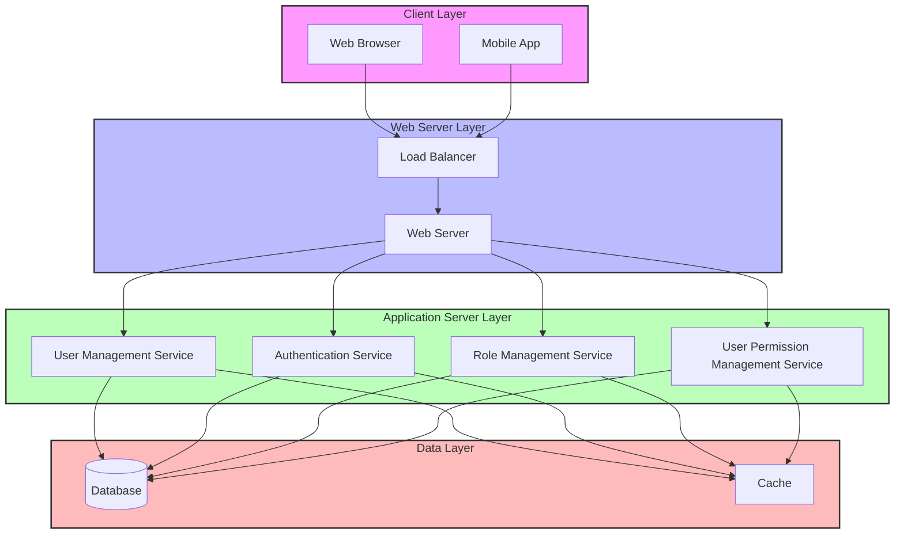
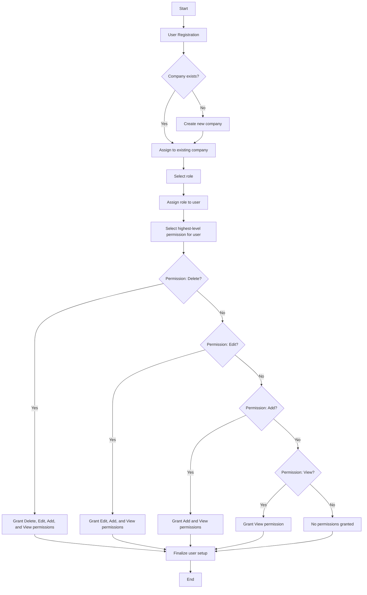

# User Registration System

This README provides an overview of the User Registration System, including its database schema, system architecture, and registration process flow.

## Table of Contents
1. [Database Schema](#database-schema)
2. [System Architecture](#system-architecture)
3. [User Registration Flow](#user-registration-flow)

## Database Schema

The database schema consists of the following tables:

- `Companies`: Stores information about companies.
- `Roles`: Defines various roles in the system.
- `Permissions`: Defines the types of permissions (View, Add, Edit, Delete).
- `Users`: Stores user information and their association with companies.
- `UserRoles`: Links users to their assigned roles.
- `UserPermissions`: Directly associates users with their permissions.

```sql
CREATE TABLE Companies (
    company_id INT PRIMARY KEY AUTO_INCREMENT,
    company_name VARCHAR(255) NOT NULL
);

CREATE TABLE Roles (
    role_id INT PRIMARY KEY AUTO_INCREMENT,
    role_name VARCHAR(100) NOT NULL
);

CREATE TABLE Permissions (
    permission_id INT PRIMARY KEY AUTO_INCREMENT,
    permission_name ENUM('View', 'Add', 'Edit', 'Delete') NOT NULL
);

CREATE TABLE Users (
    user_id INT PRIMARY KEY AUTO_INCREMENT,
    username VARCHAR(50) NOT NULL UNIQUE,
    password VARCHAR(255) NOT NULL,
    company_id INT,
    FOREIGN KEY (company_id) REFERENCES Companies(company_id)
);

CREATE TABLE UserRoles (
    user_id INT,
    role_id INT,
    PRIMARY KEY (user_id, role_id),
    FOREIGN KEY (user_id) REFERENCES Users(user_id),
    FOREIGN KEY (role_id) REFERENCES Roles(role_id)
);

CREATE TABLE UserPermissions (
    user_id INT,
    permission_id INT,
    PRIMARY KEY (user_id, permission_id),
    FOREIGN KEY (user_id) REFERENCES Users(user_id),
    FOREIGN KEY (permission_id) REFERENCES Permissions(permission_id)
);
```

## System Architecture

The system follows a multi-layered architecture:



## User Registration Flow



